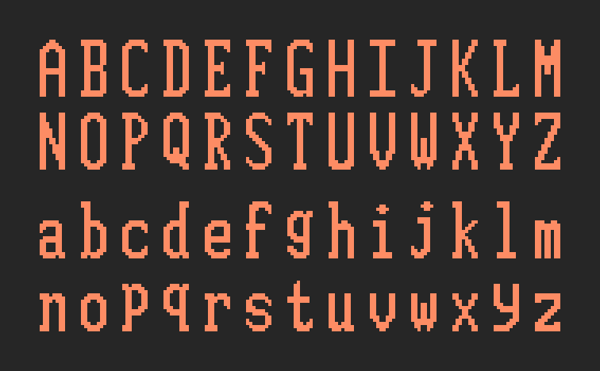
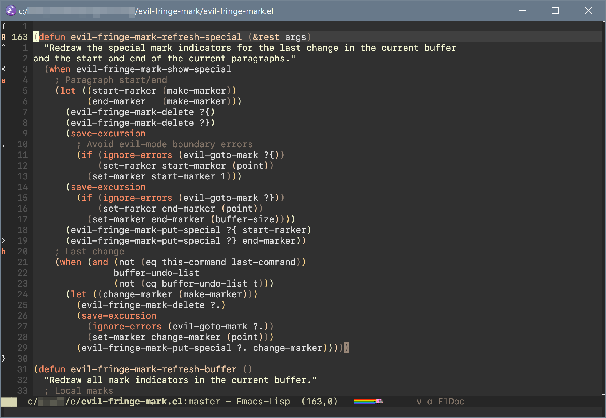

# evil-fringe-mark.el

## Introduction

`evil-fringe-mark.el` is a GNU Emacs minor mode that displays `evil-mode` marks in the fringes of active buffers.  It may be enabled globally or on a per-buffer basis as required.

## Screenshot





## Requirements

* Emacs 24.3 or higher (21.0 or higher with [cl-lib](http://elpa.gnu.org/packages/cl-lib.html))
* [evil-mode](https://github.com/emacs-evil/evil) (of course)
* [fringe-helper.el](https://github.com/nschum/fringe-helper.el)

## Installation

`evil-fringe-mark` may be installed from [MELPA](https://github.com/milkypostman/melpa.git) with `package` (`M-x package-install evil-fringe-mark`).  You may also install the package manually by placing both `evil-fringe-mark.el` and `evil-fringe-mark-overlays.el` in your `load-path` and adding the following lines in your Emacs configuration:

```
(require 'evil-fringe-mark)
(global-evil-fringe-mark-mode)
```

## Customisation

### Enable for only one buffer
To enable or disable `evil-fringe-mark` for an individual buffer, type `M-x evil-fringe-mark-mode`.  While the global mode is enabled, this command will have no effect.

### Switch display fringe

To switch the fringe in which mark overlays are displayed (`left-fringe` by default), include a variation of the following in your Emacs configuration:

```
;; Use left fringe
(setq-default left-fringe-width 16)
(setq-default evil-fringe-mark-side 'left-fringe)

;; Use right fringe
(setq-default right-fringe-width 16)
(setq-default evil-fringe-mark-side 'right-fringe)
```

Regardless of in which fringe you choose to display marks, it is recommended that you increase the width of that fringe to fully display wide characters.

### Customise character bitmaps

To change the bitmap used to display marks for a particular character or define a new character bitmap, use `fringe-helper-define`:

```
;; Change the form of uppercase "A"
(fringe-helper-define 'evil-fringe-mark-upper-a '(center)
  "...XX..."
  "..XXXX.."
  ".XXXXXX."
  "XXX..XXX"
  "XX....XX"
  "XX....XX"
  "XX....XX"
  "XX....XX"
  "XX....XX"
  "XXXXXXXX"
  "XXXXXXXX"
  "XX....XX"
  "XX....XX"
  "XX....XX"
  "XX....XX"
  "XX....XX"
  "XX....XX"
  "XX....XX")
```

Note that I am not a typographer; if you believe that you have made a significant improvement to one of the default character bitmaps, feel free to submit a pull request.
